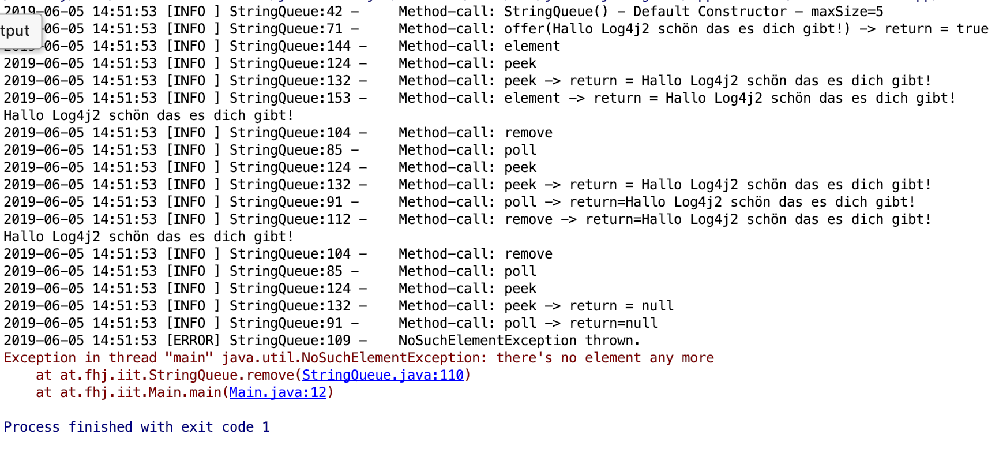

# LAB REPORT 19-Abgabe04-Schuele
***
<table>
    <tr>
        <td>Name: </td>
        <td>Denis Schüle </td>
    </tr>
    <tr>
        <td>Abgabe: </td>
        <td>4</td>
    </tr>
    <tr>
        <td>URL: </td>
        <td>https://github.com/FaberDS/19-Abgabe04-Schuele</td>
    </tr>
</table>

***
## Vorgehen
#### 1.  To-Do-List übertragen mit MD vertieft
#### 2.  Bug Suche
   Bug-Suche begann mit dem sichten der StringQueue.java. Durch die augenfälligkeit der Bugs benötigte ich keine Klasse um die StringQueue.java zu testen.
   
> ##### 2.1 Construcor typing error & senseless variable
>   Ohne Konstruktor ohne Parameter wäre die private maxSize Variable sinnbefreit.
>   Der angepasste Code ermöglicht es eien maxSize zu übergeben. Wird jedoch kein Parameter übergeben wird die maxSize dieser Queue auf 5 gesetzt.
>
>_Problem_:
>
>
>
> _Lösung_:
>
>`public StringQueue(){ this.maxSize = maxSize; }`
>
>`public StringQueue(int maxSize){ this.maxSize = maxSize;}`

> ##### 2.2 Equals 0
> Wenn die size() 0 retourniert soll ein Element gelöscht werden. Diese if Abfrage führt zu einer _IndexOutOfBoundsException_. 
>
>_Problem_:
>
>
>
> _Lösung_:
> `public String poll() {
>		String element = peek();
>		if(elements.size() > 0){
>			elements.remove(0);
>		}
>		return element;
>	}`

> ##### 2.3 Assign to empty string
> Wenn dem element "" zugewiesen wird. Ist der return-Wert der Methode immer ""
>
>_Problem_:
>
>
>
> _Lösung_:
> `//element = "";`

#### 3. Java-Doc Kommentare
Kommentieren der Klasse, des Interfaces und deren Methoden. 
    
>**3.1 Genutzt Assignments**:
>
>| Assignment    |   Bedeutung |
>| ---           |:---      |
>| @author       |   Autor     |
>| @since       |   Entstehungsdatum     |
>| @version       |   aktuelle Versionsnummer >    |
>| @see       |   Hinweise was auch beachtet >werden soll     |
>| @param       |   Um den Parameter an die >Methode zu spezifizieren     |
>| @return       |    Um den Rückgabewert der >Methode zu spezifiezieren     |
>| @exception      |   Wenn die Methode eine >Exception wirft     |
>| {@link "classname[#method name]"}       |   >Um einen Link zur Klasse/ Methode(optional) >zu setzen     |
>| @throws       |   Der Test wirft diese Exception     |

> **3.2 Eigene Tags**
>Um eigene Tags für die Java-Docs zu verwenden habe ich folgende Konfiguration innerhalb des Maven-Javadoc Plugins hinzugefügt:
>```xml
><configuration>
>    <tags>
>      <tag>
>           <!--@result is replaced true "Test assertion:"-->
>           <name>result</name>
>           <placement>a</placement>
>           <head>Test assertion:</head>
>        </tag>
>    </tags>
></configuration>
>```

> **3.3 Java-Doc Screenshot**
>

#### 4. JUnit Test
Schreiben der Tests für die StringQueue Klasse.
> **4.1 Voraussetzungen**
>Um JUnit-Tests schreiben zu können muss im pom.xml folgende Dependency eingefügt werden:
>```xml
><groupId>junit</groupId>
><artifactId>junit</artifactId>
><version>4.12</version>
><scope>test</scope>
>```
> Zum integrieren der Testwerte in die Maven Site wird noch das _Surefire-Plugin_ benötigt:
>```xml
> <groupId>org.apache.maven.plugins</groupId>
> <artifactId>maven-surefire-report-plugin</artifactId>
> <version>3.0.0-M3</version>
>```
> Gesamt wurden 25 Tests auf die 5 Methoden der StringQueue Klasse angewendet. Dabei wurden die kritschen Punkte: leere Queue, Exceptions, volle Queue. Detailierter überprüft. Es wurde ein 100% line coverage erreicht, dies muss nicht zwingend immer erreicht werden.

> **4.2 Verwendete Methoden**
>   ```java
>       assert();
>       assertTrue();
>       assertFalse();
>       assertNull();
>       assertNotNull();
>       assertEquals();
>       assertNotSame();
>```
>   Um zu überprüffen ob die Methoden `remove()` und `element()`wie in den Testfällen gewünscht eine Exception werfen, wurde folgende Annotation verwendet:
>```java
>@Test (expected = Exception-Name.class)
>```

>**4.3 Surefire Report Screenshot**
>

#### 5. Log4j2
Der Log4j2 ermöglicht das loggen während eine Java Application läuft. Sozusagen das überwachen der Aktivitäten.
Der Logger kann mittels .xml oder .properties File konfiguriert werden ich verwende letzteres.
>   **5.1 Vorraussetzungen**
>   Im main Ordner wird der resource Ordner mit dem Log4j2.properties File benötigt. 
>   _Erforderliche für pom.xml Dependencies:_
>```xml
><dependency>
>   <groupId>org.apache.logging.log4j</groupId>
>   <artifactId>log4j-api</artifactId>
>   <version>2.11.1</version>
></dependency> 
><dependency>
>   <groupId>org.apache.logging.log4j</groupId>
>   <artifactId>log4j-core</artifactId>
>   <version>2.11.1</version>
></dependency>
>```

>   **5.2 How to**
>
> Sobald die Voraussetzungen erfüllt sind mittels
> ```java
>    private static final Logger LOGGER = LogManager.getLogger(Classname.class);
>```
>   Logger in der gewünschten Klasse instanzirenen und dabei den Klassennamen übergeben.
>   Der Log2f4 stellte einige Methoden zur Verfügung:
>   ```java
>       info()
>       error()
>       debug()
>       warn()
>       fatal()
>       trace()   
>```
>   Diesen kann an den gewünschten Stellen im Code die relevante Nachricht übergeben werden.
>   Im Beispiel ist der Logger so konfiguriert das die Ausgabe nur auf der Console erfolgt.
>
>   _Formartierung_
>   `%d{yyyy-MM-dd HH:mm:ss} %-5p %c{1}:%L -\t %m\t%n>`
>       1. Datum
>       2. Level (welche Methode)
>       3. Klasse
>       4. Line
>       5. Message


>   **5.3 Logger in Action**
>   _Methodenaufruf:_
>   ```java
>       StringQueue sq = new StringQueue();
>       sq.offer("Hallo Log4j2 schön das es dich gibt!");
>       System.out.println(sq.element());
>       System.out.println(sq.remove());
>       System.out.println(sq.remove());
>```
>   _Consolenausgabe_:
> 

>   **5.4 Ausgabe**
>
>   Um die Ausgabe zu leiten muss ein appender configuriert werden.
>   _Ausgabe in ein File:_
>   ```properties
>        appender.file.type = File
>        appender.file.name = LOGFILE
>        appender.file.fileName=${filename}/propertieslogs.log
>        appender.file.layout.type=PatternLayout
>        appender.file.layout.pattern=[%-5level] %d{yyyy-MM-dd HH:mm:ss.SSS} [%t] %c{1} - %msg%n
>        
>        loggers=file
>        logger.file.name=at.fhj.iit
>        logger.file.level = debug
>        logger.file.appenderRefs = file
>        logger.file.appenderRef.file.ref = LOGFILE
>```

#### 6. Maven Site
Mithilfe von Maven Site lassen sich die erzeugten Daten angemessen repräsentieren ohne größeren Aufwand. Den größten Teil macht der generierte Content von den JUnit-Tests und der Java-Doc aus. Zusätzlich können manuell Seiten hinzugefügt werden. 
>   **6.1 Vorraussetzungen**
> Um manuell Maven Sites zu erstellen muss innerhalb des src Ordners der site Ordner angelegt werden. Dieser beinhaltet als wichtigstes Element, das site.xml File mit welchem die Struktur und Inhalt der Seite festgelegt wird. Die Seiten können in apt, markdown, xdoc, fml geschrieben werden und müssen im jeweiligen Ordner mit der jeweiligen Sprachendung gespeichert werden. Im site.xml werden diese Seiten mit der Endung .html eingebettet. Während des Maven Site Zykluses werden diese Dateien in den Target Ordner übertragen und die jeweilige Seite in HTML umgewandelt.
> _Ordnerstruktur :_
>  
>
> Im site.xml ist eines der wichtigsten Punkte der folgende XML-Tag, da dieser die Links/ Referencen zu den automatisiert erzeugten Dokumenten darstellt.
> ```xml
>   <menu ref="reports"/>
>``` 
> _Dependencies:_
>```xml
> <groupId>org.apache.maven.plugins</groupId>
> <artifactId>maven-site-plugin</artifactId>
> <version>3.7.1</version>
>```
>```xml
> <groupId>org.apache.maven.plugins</groupId>
> <artifactId>maven-project-info-reports-plugin</artifactId>
> <version>3.0.0</version>
>````

> **6.2 Optionale Inhalte/ Gestaltung:**
> Um zusätzlich Bilder oder CSS-Files einzubetten muss innerhalb des site Ordners der resources Ordner mit den Sub-Ordnern css und images angelegt werden. Während des Site Zykluses entnimmt Maven automatisiert den Inhalt dieser Ordner.
>   Bilder können mittels `./images/<imagename>` referrenziert werden.
>
> _Syntax zum einbinden von Bildern:_ 
>```md
>(<url für Lik>)
>```
>  Title und URL ist optional und die [] des alternativ Text können auch leer bleiben.  
> _Ordnerstruktur für zusätzliche Ressourcen (optional):_
>  
>
>  **Maven Fluido Skin**
>
>   Um das gesamte Design auf den neuen Standard anzuheben kann Maven Fluido Skin verwendet werden.
>   Im `<custom>` können Style Parameter gesetzt werden.

>   ```xml
>    <skin>
>            <groupId>org.apache.maven.skins</groupId>
>            <artifactId>maven-fluido-skin</artifactId>
>            <version>1.5</version>
>        </skin>
>    
>        <custom>
>            <fluidoSkin>
>                <topBarEnabled>true</topBarEnabled>
>                <sideBarEnabled>false</sideBarEnabled>
>            </fluidoSkin>
>        </custom>
>```

>   **6.3 Screenshot der Seiten**
>
>   _6.3.1 About_
>
>   Standardmäßig ist die About die index.html diese sollte somit als Minimum in der entsprechenden Markup Sprache angepasst werden. 
>   
>   _6.3.2 Queue Subpage_
>
>   

>   **6.4 Delete Goal**
>
>   Dieses Plugin startet das "clean" Goal in der Initialize Phase, somit wird bei jedem Build einmal alles gebuildet.
>   ```xml
>   <plugin>
>       <executions>
>       <artifactId>maven-clean-plugin</artifactId>
>       <version>3.1.0</version>
>           <execution>
>               <id>auto-clean</id>
>               <phase>initialize</phase>
>               <goals>
>                   <goal>clean</goal>
>               </goals>
>           </execution>
>       </executions>
>   </plugin>
>```

#### 7. Markdown Übung
Github Flavor ist einer der meist verwendeten Markdown Dialekte. Er legt die Syntax und Semantic fest und wird auf den github domains verwendet.
> **7.1 Java Code**
> ```java
>   if(theWeatherIsNice)
>   {
>   System.out.println("Hello world on this awesome day!");
>   }
>   else 
>   {
>   System.out.println("The weather sucks"); 
>   }
>```

> **7.2 Phyton Code**
>```python
>   #!/usr/bin/python
>   if weatherIsNice:
>       print "Hello world on this awesome day!"
>   else:
>       print "The weather sucks"
>```
***
## Links/ Literatur
### Plugins
- Markdown All in One 2.3.1 (für VS Code)
### Links
- [github Flavored](https://github.github.com/gfm/)
- [Markdown Guide Github](https://guides.github.com/features/mastering-markdown/)
- [junit Artikel](http://www.tutego.de/blog/javainsel/2010/04/junit-4-tutorial-java-tests-mit-junit/)
- [maven tags](https://maven.apache.org/plugins/maven-javadoc-plugin/examples/tag-configuration.html)
- [tutorials-point Java-doc](https://www.tutorialspoint.com/java/java_documentation.htm)
- [How to write doc comments](https://www.oracle.com/technetwork/java/javase/documentation/index-137868.html)
- [Syntax highlighting Markdown](https://support.codebasehq.com/articles/tips-tricks/syntax-highlighting-in-markdown)
- [Konfigurations Management Repository](https://github.com/michaelulm/software-configuration-management)
- [Log2f4 Tutorial](https://www.youtube.com/watch?v=YGG-_irDc5k)
- [Log2f4 Basic](https://www.tutorialspoint.com/log4j/log4j_logging_files.htm)
- [Maven Site Infos](https://blog.akquinet.de/2012/04/12/maven-sites-reloaded/)
- [Phyton Basic](https://www.tutorialspoint.com/python/python_if_else.htm)
- [Customice Maven Site Styling](https://books.sonatype.com/mvnref-book/reference/site-generation.html)
### Documents

***
## To-Do-List:
 - [x] Übertragen Angabe Tasklist in Markdown Readme
 - [x] Einspielen Queue Vorlage aus Repository https://github.com/michaelulm/software-
configuration-management/tree/master/test-automation/Queue
 - [x] Taskergebnisse Schritt für Schritt auf Git stellen
   - [x] Führung Taskliste
   - [x] Veröffentlichung in Git mit aktuell durchgeführten Tätigkeiten, z.B. Testfälle geschrieben so wird auch in der Taskliste diese Aufgabe als erledigt markiert und Testfälle inkl. geänderter Taskliste ins Repository übertragen.
- [x] Korrigieren Sie den Code bzw. Debuggen Sie ihn um die Fehler zu finden
    - [x] Es befinden sich gesamt 3 Fehler im Source Code
    - [x] Bei Bedarf Optimieren Sie das Queue Beispiel.
    - [x] Ergänzen Sie das Beispiel nach eigenen Ermessen um es testen zu können.

- [x] Erstellen Sie für Klasse und alle Methoden Kommentare um mittels Javadoc eine API Dokumentation zu erzeugen
    - [x] Integrieren Sie ein Bild (der generierten Dokumentation) in Ihren Report.
- [x] Erstellung JUnit Tests (vollständig testen, mehere Varianten)
    - [x] Sie werden die "selben" Testfälle mehrfach erstellen müssen um "mehrere Variationen" für einen möglichst vollständigen Test zu erreichen. Achten Sie dabei mit unterschiedlichen Daten zu testen.
    - [x] JavaDoc Kommentare erstellen.
    - [x] Integrieren Sie ein Bild (der generierten Dokumentation) in Ihren Report.
- [x] Passen Sie Ihr pom.xml auf das Projekt an, damit Sie das Projekt erstellen aber auch Dokumentation generieren können.
    - [x] EntwicklerInnen Informationen hinzufügen.
    - [x] Integration Logging Bibliothek log4j mittels Maven Dependencies.
- [x] Log4j(Version 2) integrieren und in jeder Methode ins Log schreiben
    - [x] Siehe aktualisiertes Stack Beispiel
    - [x] Erstellen Sie einen Statischen Logger der auf die Konsole schreibt.
    - [x] Konfigurieren Sie Logger über ein properties File.
    - [x] Geben Sie eine Info Lognachricht bei Aufruf einer jeden Methode aus.
    - [x] Geben Sie eine Error Lognachricht aus bevor Sie einen Fehler werfen.
    Ergebnisse (Konsolenausgabe) als Bild in Dokumentation einfließen lassen.
- [x] Maven Site Dokumentation erstellen
    - [x] Inklusive Javadoc Code und Javadoc Test Klassen
    - [x] Inklusive Menü mit Verweis auf manuell erstelle Seite
        - [x] Seite erläutert Funktionsweise Queue
    - [x] Geben Sie ein Bild der Maven Site Dokumentation in den Lab Report
        - [x] Der Inhalt der manuell erstellten Seite sollte ersichtlich sein
- [ ] Erstellung detaillierter und nachvollziehbarer Markdown Lab Report
    - [x] Übertragung Information auf Labreport Template
    - [x] Alle Schritte dieser Übung nachvollziehbar erläutern.
    - [x] Übung Github Flavor: Erstellen Sie einen Codeblock im Dokument, welcher 3 Zeilen Python und 3 Zeilen Java Source Code korrekt darstellt.
    - [ ] Korrekturlesen Dokumentation
    - [ ] PDF erstellen (zB. Dillinger)
