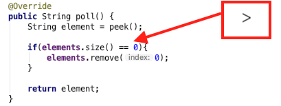

# LAB REPORT 19-Abgabe04-Schuele
***
Name: | Denis Schüle
------|:-------------
**Abgabe:** | 4
**url:** | https://github.com/FaberDS/19-Abgabe04-Schuele
***
## Vorgehen
#### 1.  To-Do-List übertragen mit MD vertieft
#### 2.  Bug Suche
   Bug-Suche begann mit dem sichten der StringQueue.java. Durch die augenfälligkeit der Bugs benötigte ich keine Klasse um die StringQueue.java zu testen.
   
> ##### 2.1 Construcor typing error & senseless variable
>   Ohne Konstruktor ohne Parameter wäre die private maxSize Variable sinnbefreit.
>   Der angepasste Code ermöglicht es eien maxSize zu übergeben. Wird jedoch kein Parameter übergeben wird die maxSize dieser Queue auf 5 gesetzt.
>
>**Problem**:
>
>
>
> **Lösung**:
>
>`public StringQueue(){ this.maxSize = maxSize; }`
>
>`public StringQueue(int maxSize){ this.maxSize = maxSize;}`

> ##### 2.2 Equals 0
> Wenn die size() 0 retourniert soll ein Element gelöscht werden. Diese if Abfrage führt zu einer _IndexOutOfBoundsException_. 
>
>**Problem**:
>
>
>
> **Lösung**:
> `public String poll() {
>		String element = peek();
>		if(elements.size() > 0){
>			elements.remove(0);
>		}
>		return element;
>	}`

> ##### 2.3 Assign to empty string
> Wenn dem element "" zugewiesen wird. Ist der return-Wert der Methode immer ""
>
>**Problem**:
>
>
>
> **Lösung**:
> `//element = "";`
***
## Links/ Literatur
### Plugins
- Markdown All in One 2.3.1 (für VS Code)
### Links
- [github Flavored](https://github.github.com/gfm/)
- [junit Artikel](http://www.tutego.de/blog/javainsel/2010/04/junit-4-tutorial-java-tests-mit-junit/)
- [maven tags](https://maven.apache.org/plugins/maven-javadoc-plugin/examples/tag-configuration.html)
***
## To-Do-List:
 - [x] Übertragen Angabe Tasklist in Markdown Readme
 - [x] Einspielen Queue Vorlage aus Repository https://github.com/michaelulm/software-
configuration-management/tree/master/test-automation/Queue
 - [ ] Taskergebnisse Schritt für Schritt auf Git stellen
   - [ ] Führung Taskliste
   - [ ] Veröffentlichung in Git mit aktuell durchgeführten Tätigkeiten, z.B. Testfälle geschrieben so wird auch in der Taskliste diese Aufgabe als erledigt markiert und Testfälle inkl. geänderter Taskliste ins Repository übertragen.
- [x] Korrigieren Sie den Code bzw. Debuggen Sie ihn um die Fehler zu finden
    - [x] Es befinden sich gesamt 3 Fehler im Source Code
    - [x] Bei Bedarf Optimieren Sie das Queue Beispiel.
    - [x] Ergänzen Sie das Beispiel nach eigenen Ermessen um es testen zu können.

- [ ] Erstellen Sie für Klasse und alle Methoden Kommentare um mittels Javadoc eine API Dokumentation zu erzeugen
    - [ ] Integrieren Sie ein Bild (der generierten Dokumentation) in Ihren Report.
- [ ] Erstellung JUnit Tests (vollständig testen, mehere Varianten)
    - [ ] Sie werden die "selben" Testfälle mehrfach erstellen müssen um "mehrere Variationen" für einen möglichst vollständigen Test zu erreichen. Achten Sie dabei mit unterschiedlichen Daten zu testen.
    - [ ] JavaDoc Kommentare erstellen.
    - [ ] Integrieren Sie ein Bild (der generierten Dokumentation) in Ihren Report.
- [ ] Passen Sie Ihr pom.xml auf das Projekt an, damit Sie das Projekt erstellen aber auch Dokumentation generieren können.
    - [x] EntwicklerInnen Informationen hinzufügen.
    - [ ] Integration Logging Bibliothek log4j mittels Maven Dependencies.
- [ ] Log4j(Version 2) integrieren und in jeder Methode ins Log schreiben
    - [ ] Siehe aktualisiertes Stack Beispiel
    - [ ] Erstellen Sie einen Statischen Logger der auf die Konsole schreibt.
    - [ ] Konfigurieren Sie Logger über ein properties File.
    - [ ] Geben Sie eine Info Lognachricht bei Aufruf einer jeden Methode aus.
    - [ ] Geben Sie eine Error Lognachricht aus bevor Sie einen Fehler werfen.
    Ergebnisse (Konsolenausgabe) als Bild in Dokumentation einfließen lassen.
- [ ] Maven Site Dokumentation erstellen
    - [ ] Inklusive Javadoc Code und Javadoc Test Klassen
    - [ ] Inklusive Menü mit Verweis auf manuell erstelle Seite
        - [ ] Seite erläutert Funktionsweise Queue
    - [ ] Geben Sie ein Bild der Maven Site Dokumentation in den Lab Report
        - [ ] Der Inhalt der manuell erstellten Seite sollte ersichtlich sein
- [ ] Erstellung detaillierter und nachvollziehbarer Markdown Lab Report
    - [x] Übertragung Information auf Labreport Template
    - [ ] Alle Schritte dieser Übung nachvollziehbar erläutern.
    - [ ] Übung Github Flavor: Erstellen Sie einen Codeblock im Dokument, welcher 3 Zeilen Python und 3 Zeilen Java Source Code korrekt darstellt.
    - [ ] Korrekturlesen Dokumentation
    - [ ] PDF erstellen (zB. Dillinger)